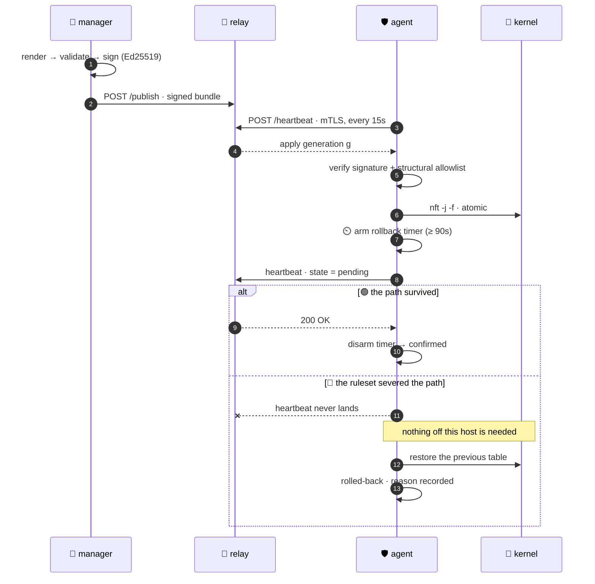
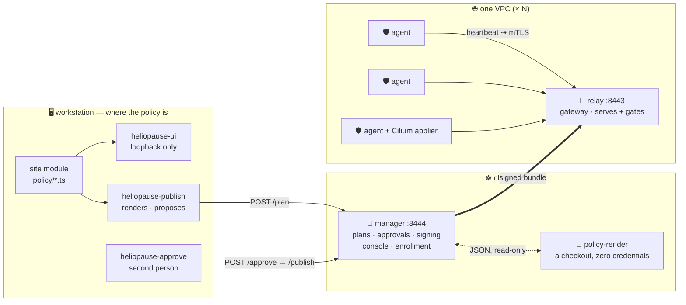
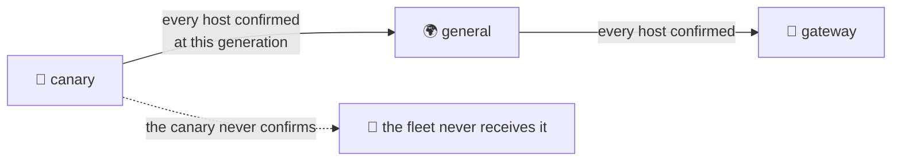
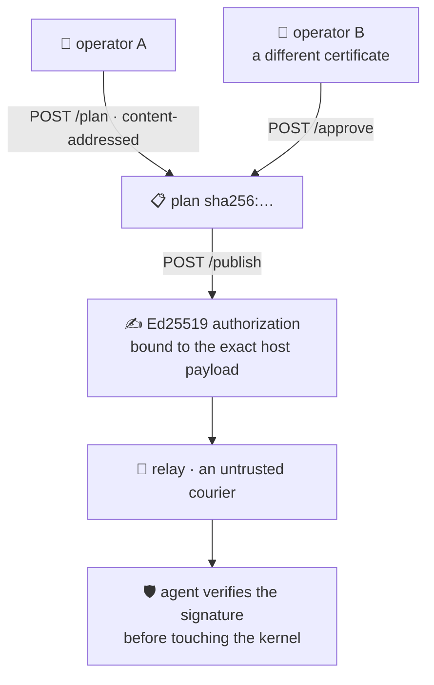

<div align="center">

<h1>🛰️ heliopause</h1>

### **A host firewall you can't lock yourself out of.**

Declarative `nftables` for a whole fleet, with a **commit → confirm → auto-rollback**
control plane borrowed from network gear and made to work on Linux hosts.

<br/>

[](https://github.com/henryj-dev/heliopause/actions/workflows/ci.yml)
[](https://github.com/henryj-dev/heliopause/actions/workflows/codeql.yml)
[](https://github.com/henryj-dev/heliopause/actions/workflows/scorecard.yml)
[](https://github.com/henryj-dev/heliopause/actions/workflows/trusted-leaks.yml)

<br/>


[](LICENSE)

<br/>

> The **heliopause** is the boundary where the Sun's protective bubble meets interstellar space —
> the edge of the region it shields.
> That is what this manages: **the edge of your hosts.**

</div>

---

## Contents

- [The problem](#the-problem)
- [Safety invariants](#safety-invariants)
- [Quick start](#quick-start)
- [How it fits together](#how-it-fits-together)
- [The policy model](#the-policy-model)
- [Two enforcement points, reported separately](#two-enforcement-points-reported-separately)
- [Staged rollout](#staged-rollout)
- [Trust, identity and the chain of custody](#trust-identity-and-the-chain-of-custody)
- [Command line](#command-line)
- [The console](#the-console)
- [Development](#development)
- [Status & limitations](#status--limitations)
- [License](#license)

---

## The problem

Managing host firewalls at scale usually means one of three things:

|   | approach | how it fails |
|---|---|---|
| 🧨 | hand-written `nftables` over SSH | no way back once the rule that severs your session lands |
| 🏚️ | `firewalld` / `ufw` | fine locally; no central policy, no audit trail, no "apply everywhere then verify" |
| 🤖 | config management | happily converges a host into unreachability, then reports success |

All three share one failure mode: **the change that locks you out is applied exactly like any
other change.**

heliopause makes that structurally hard. Every apply carries its own undo, and the undo does not
depend on anything off the host still working.



The last branch is the product. Everything else in this repository is arrangements around it —
and it is exercised against a **real kernel** in CI on every pull request
(`scripts/rollback-test.sh`).

---

## Safety invariants

Not aspirations. Each is enforced in code, and each came from a measured failure.

| ✅ | invariant | what it prevents |
|---|---|---|
| 🔒 | **Only ever touches its own table.** The agent refuses a submitted ruleset naming any other table | your existing `firewalld` / `iptables` rules quietly disappearing |
| 🚫 | **`flush ruleset` is refused, always** | one line away from wiping a host's firewall |
| 🧱 | **Baseline allows are non-removable.** They render ahead of policy, and an overlapping policy is *rejected with a reason* | a rule that silently does nothing, next to a dashboard that says it works |
| 🔁 | **`ct state established,related accept` is first**, in both chains | a broad deny killing the replies to connections the host opened — SSH dies mid-session |
| 🏠 | **`iif lo accept` is prepended under `policy drop`** | 127.0.0.1 becoming unreachable and every localhost-over-TCP service breaking |
| 📣 | **Nothing is silently skipped.** A policy that cannot render comes back with a reason | believing in controls that do not exist. *A skipped deny is an open port* |
| 🧭 | **Render errors fail the whole generation** rather than emitting a partial ruleset | a host open while every screen reports it closed |
| ⚖️ | **"not known" ≠ "none"** — `null` and `[]` never collapse | an unreadable cluster reading as a clean apply |
| 🛑 | **Protected hosts require an explicit opt-in** — but **rollback is never gated** | a batch job that forgot a flag taking out the router; being unable to undo during the incident |

<details>
<summary><b>The one configuration that is certainly wrong — and is refused at construction</b></summary>

<br/>

`defineConfig` throws rather than letting you build it:

```
hookPolicy.input is 'drop' with an empty baseline — this locks every host out of itself.
Define the management paths in `baseline` first.
```

It also bounds the confirm window against the heartbeat interval, because a window shorter than
two beats means **every** apply rolls back on schedule no matter how healthy the host is — which
reads as "heliopause is broken" rather than "this number is wrong".

</details>

---

## Quick start

[`examples/site.ts`](examples/site.ts) is a complete, runnable site module — two hosts, a staged
rollout, a dropping input hook with a real baseline, and every address an RFC 5737 documentation
range. It is the file to copy when starting a real policy, and the first thing to change in it is
every address.

```bash
git clone https://github.com/henryj-dev/heliopause && cd heliopause
npm ci

npm test                    # renders the example and asserts the invariants above
node bin/heliopause-publish.ts examples/site.ts ./artifacts --dry-run --allow-dirty
node bin/heliopause-ui.ts examples/site.ts     # → http://127.0.0.1:8500
```

The dry run prints what *would* be published and writes nothing:

```
generation 1981732-dirty-9b73df1b  (2 hosts)
  web-01.example.com canary   2 policy rules  sha256:af470349ff80a
  web-02.example.com general  2 policy rules  sha256:af470349ff80a
dry run — nothing written
```

Both hosts render the same digest because they enforce the same two policies — content-addressing
is what lets drift, approval and cross-generation comparison all be one question about bytes.

---

## How it fits together



**The control plane is a library, not a service.** You embed it in whatever already knows your
inventory — which host has which address, which zone it is in. heliopause does not discover your
infrastructure; you inject a resolver.

| process | runs where | holds | may |
|---|---|---|---|
| 🧠 **manager** | one per site | signing key, operator certs, approvals | render, sign, publish, serve the console |
| 📡 **relay** | one per gateway | published artifacts only | serve what it was given, gate on what agents reported |
| 🛡️ **agent** | every host | its own certificate | apply, observe, roll itself back |
| 🧾 **policy-render** | beside the manager | a policy checkout, *nothing else* | answer one question in JSON |
| 🖥️ **heliopause-ui** | operator laptop | the working tree | read your **uncommitted** policy |

The manager is optional in the strongest sense: relays keep serving without it, and
`heliopause-publish --break-glass` writes straight to a gateway's artifact directory — so the way
out of an incident never depends on the manager being healthy.

<details>
<summary><b>Why the relay is deliberately unable to decide anything</b></summary>

<br/>

A gateway is the most exposed machine in each VPC. So the blast radius of it being wrong — or
owned — is kept to *"the hosts behind it stop receiving updates"*, never *"the hosts behind it get
told anything an attacker likes"*.

`POST /publish` does not change that: it **accepts** a generation rather than producing one, and
the bundle is checked against the digests its own manifest carries — the same digests the agents
check. On top of that, every host payload is signed by the manager's Ed25519 key, which the relay
never holds. What a compromised relay can do — refuse pushes, serve a stale generation — it could
already do by being unreachable, which is why the fleet view reports generations per VPC.

</details>

<details>
<summary><b>Why the agent pulls, and why the project runs on Node rather than Bun</b></summary>

<br/>

**The agent listens on nothing.** The previous design POSTed rulesets to an HTTP server on every
host — an inbound attack surface on a firewall host, which the control plane also had to be able
to reach, so it could not be firewalled off either. Here the agent opens every connection, and
three properties follow:

1. Nothing to reach, nothing to authenticate inbound.
2. **The heartbeat *is* the confirm signal**, so rollback survives the control plane being down.
3. Rollback is armed only for the generation just applied — once confirmed, a later heartbeat
   failure means *"updates have stopped"*, not *"undo"*. Without that distinction a gateway outage
   would make every host in the VPC revert a change that was fine.

**Bun cannot read the client certificate.** `Bun.serve` enforces `requestCert`/`rejectUnauthorized`,
but neither it nor Bun's `node:https` shim exposes the peer certificate to the handler — so there
is no way to learn *which* agent is calling. Node's `req.socket.getPeerCertificate()` returns it,
and that single fact decides the security model: without it, every heartbeat's `host` field is an
unverified self-assertion, a compromised low-value host reports as the canary, and staged rollout
becomes decorative.

</details>

---

## The policy model

A policy says *"this source, to this destination, on these ports → allow or deny."* It never
mentions nftables. Rendering happens separately; resolving names to addresses is **injected**.

```ts
const publicWeb: Policy = {
  id: "example-web",
  name: "public web",
  src: { kind: "internet" },
  dst: { kind: "cidr", value: "198.51.100.0/24" },
  proto: "tcp",
  ports: "80,443",
  action: "allow",
  denyMode: "drop",
  priority: 100,
  enabled: true,
};
```

`ports` accepts `"22"`, `"80,443"`, `"1000:2000"`, `"@service-object"`, or `""` for every port.
`priority` only becomes significant once the chain default is deny. `denyMode` is a *sub-mode* of
`deny` rather than a third action, so that enforcement layers which can express "block" but not
"reject" degrade in style instead of in meaning.

### Endpoint kinds

<table>
<tr><th>kind</th><th>means</th><th>side</th></tr>
<tr><td><code>host</code></td><td>a single host by name — resolved by your resolver</td><td>either</td></tr>
<tr><td><code>host-group</code></td><td>a named set of hosts, also resolver-defined</td><td>either</td></tr>
<tr><td><code>cidr</code></td><td>a literal prefix, <code>10.0.0.0/8</code></td><td>either</td></tr>
<tr><td><code>object</code></td><td>a reusable named address object</td><td>either</td></tr>
<tr><td><code>internet</code></td><td>everything outside <code>internalSupernet</code></td><td>either</td></tr>
<tr><td><code>any</code></td><td>no address constraint at all</td><td>either</td></tr>
<tr><td><code>k8s-service</code></td><td><code>namespace/name</code> — the stable unit; pod addresses die in hours</td><td>🎯 <b>dst only</b></td></tr>
<tr><td><code>k8s-namespace</code></td><td>every pod in a namespace — covers workloads that only <i>send</i>, such as CI runners</td><td>either</td></tr>
<tr><td><code>k8s-label</code></td><td>a pod label selector, several ANDed with commas</td><td>either</td></tr>
<tr><td><code>k8s-entity</code></td><td>Cilium's reserved <code>host</code> identity — keeps kubelet probes alive under a default-deny ingress</td><td>either</td></tr>
<tr><td><code>geofeed</code></td><td><code>&lt;feed&gt;:&lt;selector&gt;</code>, e.g. <code>cloudflare:KR</code>, from a hashed snapshot</td><td>📍 <b>src only</b></td></tr>
<tr><td><code>cf-device</code></td><td>one approved WARP device, by <b>device id</b> — never by name, which its owner can rename</td><td>either</td></tr>
<tr><td><code>cf-user</code></td><td>one approved person — the union of their registered devices</td><td>either</td></tr>
</table>

> [!WARNING]
> **`geofeed` narrows an origin; it does not authenticate one.** `vultr:KR` contains every other
> customer renting an instance in Seoul. `cloudflare:KR` includes an attacker who pointed their own
> zone at your origin. The real effect is a smaller attack surface — internet-wide scanning and
> direct hits go away. Authentication is Authenticated Origin Pulls or a shared secret, not an
> address list.

### Two chain modes, chosen per hook

| `hookPolicy` | what renders | what it is for |
|---|---|---|
| `accept` *(default)* | denies only — `allow` policies are reported as **skipped**, never dropped | coexisting with firewalld while you migrate; `drop` is terminal but `accept` is chain-local |
| `drop` | default-deny — `allow` becomes a real rule, everything unlisted is refused | the configuration that actually closes ports, **and the one that locks you out if the baseline is wrong** |

> [!IMPORTANT]
> The intended migration is **asymmetric: input drops, output keeps accepting.** Closing inbound is
> the goal. Closing outbound in the same change would cut the agent's heartbeat — which is what
> confirms an apply, and what carries the instruction to undo one.

The `forward` hook is untouched by default, and that default is deliberate: a default-deny forward
chain would be a firewall for traffic nobody described — container networking, virtual machines,
whatever the host routes tomorrow. Where a gateway genuinely needs it, `forward.guardInternal`
refuses to route a packet *into* the internal supernet unless it came from there, and
`forward.hosts` names exactly which hosts get the chain rather than defaulting to all of them.

---

## Two enforcement points, reported separately

On a node running Cilium, pod and ClusterIP traffic is resolved in eBPF and **never reaches a
netfilter hook**. No nftables rule can govern it. So a policy naming a pod destination is rendered
to `CiliumNetworkPolicy` instead — and that layer has nothing behind it if it fails.

| | 🐧 host layer | ☸️ workload layer |
|---|---|---|
| renders to | `nft -j -f` JSON document | `CiliumNetworkPolicy` CRDs |
| applied by | every agent | **one** designated applier node |
| rollback timer | `confirmTimeoutSec` (≥ 90s) | `workload.confirmTimeoutSec`, **strictly longer** |
| readback proof | rule comments must be present (`mustContain`) | objects re-read by name and exact content (`mustExist`) |
| failure mode | SSH and the relay die → short timer | app traffic breaks, node access survives → Cilium needs time to converge |

The two halves are tracked as separate states, because **they genuinely disagree**: the ruleset
confirms while `kubectl apply` fails, or the reverse. A single field would have to pick one, and
either choice hides a half-enforced generation behind a clean status.

> A Kubernetes write returning `0` is not evidence the policy is in force. It proves the API server
> accepted the documents — Cilium will happily accept a policy that selects nothing.

Rollback there is **identity-bound**: an existing object must already carry heliopause's
managed-by/cluster/name identity before it is touched, and a controller replacement under the same
name is left alone rather than overwritten.

---

## Staged rollout



The value is entirely in the failure case: a policy that locks hosts out locks out the canary, the
canary never confirms, and nothing else ever sees it.

The **relay** evaluates the gate on every heartbeat, as a pure function of recorded state — a
rollout that needed the manager online to advance would stall the moment the manager restarted
mid-deploy.

<details>
<summary><b>What a host status can say, and why silence outranks the stored state</b></summary>

<br/>

`ApplyState` — `none` · `pending` · `confirmed` · `rolled-back` · `unsupported`.

But a *verdict* is not the same as a state. `state` is the last thing a host said, not a statement
about now. One host was dead for nine hours while the site view printed a green `confirmed`,
because that genuinely was its last word. So one ordering decides both views:

```
drift ▸ rolled-back ▸ maintenance ▸ never-seen ▸ silent (>90s) ▸ behind ▸ confirmed
```

`drift` outranks silence: a host that drifted and *then* went quiet has a specific problem, and
reporting only the silence would lose it. `maintenance` outranks silence because it is a sentence a
person wrote on purpose — but stays below drift and rollback, which are evidence the host itself
produced.

</details>

---

## Trust, identity and the chain of custody



| mechanism | what it says | where |
|---|---|---|
| 🤝 **mutual TLS, both directions** | the relay knows which host reports; the agent knows it is not being fed a ruleset by an impostor | `RelayConfig` · `TlsConfig` |
| 🪪 **identity binding** | the claimed `host` must equal the certificate subject CN | relay, on every heartbeat |
| 👥 **two-person publishing** | the approver may not be the proposer, and both name the *same bytes* | `approval.ts`, 10-minute plan TTL |
| ✍️ **artifact signing** | "the bytes that arrived are the bytes that were approved" — hashes alone only catch accidents | `artifact-signature.ts` |
| 🔑 **two signing rings** | `manager` (online, ≤ 7 days) and `break-glass` (offline, ≤ 24 hours) | agents trust the *set*, which makes rotation zero-downtime |
| 🧾 **built-in PKI** | `ca` · `relay` · `agent` · `operator` roles, ECDSA P-256, CA 3650 days / leaves 90 | `heliopause-pki` |
| 🚫 **fail-closed revocation** | a locked, socket-activated writer owns the denylist; updates may add rows but never omit or rewrite one | `revocation-writer.ts` |

> [!NOTE]
> **No external PKI is required and none is assumed.** `heliopause-pki` issues everything the
> control channel needs, reading the host list straight from your site module — so the set that
> gets certificates and the set that gets rendered come from one source. An operator with a
> corporate CA ignores the command entirely and points the config at their own files; the relay and
> agent only ever read paths.

<details>
<summary><b>Why an agent certificate cannot read the fleet view</b></summary>

<br/>

An agent fetches its own ruleset and reports its own state. The fleet view names **every** host,
its generation, and whether its ruleset has drifted — for whoever owns one machine, that is the
list of next targets, annotated with which of them is currently unprotected.

So `operator` is a separate role, checked by exact CN against an explicit allowlist. No wildcards,
no prefix rules. An agent certificate gets `403`.

</details>

---

## Command line

<div align="center">

| | command | does |
|---|---|---|
| 🏗️ | `heliopause-pki` | `init` · `issue` · `site` · `status` · `renew` · `sign-csr` — the control channel's own certificates |
| 📤 | `heliopause-publish` | render every host; `--propose` to a manager, or `--break-glass` straight to an artifact directory |
| ✅ | `heliopause-approve` | list pending plans, `--approve` one, `--push` an approved one — *from a different certificate* |
| 📊 | `heliopause-status` | read a relay's `/status`, or `--site` for every VPC at once; `--watch`, `--json` |
| 🧠 | `heliopause-manager` | the site manager: plans, approvals, signing, enrollment, console |
| 📡 | `heliopause-relay` | one per gateway: serve artifacts, collect heartbeats, evaluate the gate |
| 🧾 | `heliopause-policy-render` | the isolated renderer the manager console reads from |
| 🖥️ | `heliopause-ui` | the workstation policy screens, loopback only |
| 📝 | `heliopause-policy` | the managed policy document: `init` · `export-site` · `put` · `placement-add` · … |
| 🎫 | `heliopause-enrollment` | node tokens, CSR queue, certificate upload, revocation — locally or over the API |
| 🔒 | `heliopause-revocations` | `init` a relay's denylist; `compact` one that filled up |
| 🔐 | `heliopause-revocation-writer` | the socket-activated, privilege-separated denylist owner |
| 🌍 | `heliopause-feed` | `list` · `refresh` · `show` — geofeed snapshots, fetched deliberately, never at render time |
| 💻 | `heliopause-devices` | diff the approved device registry against Cloudflare and print the edit to paste |
| 🎯 | `heliopause-coverage` | probe from outside and record what was observed — the only reading that believes nothing the fleet says |

</div>

### A generation, end to end

1. Certificates for everything the site module names.

   ```bash
   node bin/heliopause-pki.ts site ./pki policy/dev.ts
   ```

2. Render and submit for review — nothing has changed yet.

   ```bash
   node bin/heliopause-publish.ts policy/dev.ts dev \
     --propose=https://manager.example:8444 --pki=./pki --operator=ops-alice
   ```

3. A different person, a different certificate.

   ```bash
   node bin/heliopause-approve.ts https://manager.example:8444 --pki=./pki --operator=ops-bob
   node bin/heliopause-approve.ts https://manager.example:8444 <plan-hash> --approve
   node bin/heliopause-approve.ts https://manager.example:8444 <plan-hash> --push
   ```

4. Watch it land, stage by stage.

   ```bash
   node bin/heliopause-status.ts https://manager.example:8444 --site --pki=./pki --watch
   ```

Approving and pushing are separate flags on purpose. They could be one step — except the approver
is the person who did *not* render the plan, and making their action also push means the fleet
changes at the moment somebody finishes reading a diff.

<details>
<summary><b>Managed policy document · standalone enrollment · offline CSR signing</b></summary>

<br/>

**Managed policy document.** Schema 2 stores policy definitions and their host-ingress, host-egress
or workload placements. Publishing refuses an unplaced policy or an unknown host. Exporting an
existing site preserves CIDR order, and therefore produces **byte-identical** nftables and Cilium
artifacts.

```bash
node bin/heliopause-policy.ts export-site policy/dev.ts ./policies.json
node bin/heliopause-ui.ts policy/dev.ts --policies=./policies.json
node bin/heliopause-publish.ts policy/dev.ts dev --policies=./policies.json \
  --propose=https://manager.example:8444 --pki=./pki --operator=ops-alice
```

<br/>

**Standalone enrollment.** Set `HELIOPAUSE_ENROLLMENT_STORE` on the manager. No dispatcher,
database or identity provider is required; OIDC and TOTP remain optional. The same store is
operated locally or over the manager API:

```bash
node bin/heliopause-enrollment.ts init ./enrollment.json
node bin/heliopause-enrollment.ts token-create ./enrollment.json host-01.example --actor=ops-alice
node bin/heliopause-enrollment.ts csr-list https://manager.example:8444 --pki=./pki
node bin/heliopause-enrollment.ts cert-upload https://manager.example:8444 REQUEST_ID \
  --cert=./host.pem --ca-name=site --pki=./pki
node bin/heliopause-enrollment.ts cert-revoke https://manager.example:8444 \
  --cert=./host.pem --reason=retired --pki=./pki
```

`init` is an explicit, one-time deployment step and refuses to overwrite an existing file. The
manager and every write command refuse a missing or malformed store — they never guess that a
deleted revocation ledger is a harmless first boot. **Back this file up and restore it**; do not
run `init` again once it has held any certificate revocation.

Point the manager at its revocation source with `HELIOPAUSE_REVOCATION_FILE`. It replicates a
minimal snapshot to every relay over the existing publisher mTLS identity at startup, after each
revocation, and once per minute. Provision each relay's empty denylist exactly once with
`heliopause-revocations init` — normal relay startup never creates or repairs that file. A
separate locked service account owns it and accepts only bounded, strict, monotonic snapshots; the
network-facing relay holds read access plus permission to connect to one Unix socket, and never
opens the file for writing. Relays reload it on every request, and a missing or malformed file
fails closed rather than restoring a revoked credential. See
[`packaging/systemd/README.md`](packaging/systemd/README.md) for the required sysusers,
initialization, socket and enable order.

When one publicly trusted certificate covers more than one entry name, set the exact SNI allowlist
with `HELIOPAUSE_PUBLIC_SERVER_NAMES=manager.example,node-ingest.example`. The singular
`HELIOPAUSE_PUBLIC_SERVER_NAME` remains accepted for one-name deployments.

<br/>

**Signing a host-generated CSR offline.** The host keeps its private key. After comparing the CSR
SHA-256 shown by the host against the value in the enrollment queue *over a separate channel*:

```bash
node bin/heliopause-pki.ts sign-csr ./offline-ca ./host.csr ./host.pem \
  --name=host-01.example \
  --expect-sha256=0123456789abcdef0123456789abcdef0123456789abcdef0123456789abcdef
```

The fingerprint is **mandatory**. The command verifies the CSR signature, the exact single-CN
subject and the ECDSA P-256 key, refuses to overwrite an output, and applies the same 90-day
`clientAuth`-only profile as `heliopause-pki issue`. CSR-requested extensions are never copied. The
CA private key stays in `./offline-ca`; the host private key never reaches it.

</details>

---

## The console

One SvelteKit build, served by both the manager and the workstation UI. **English and Korean**,
switchable at runtime. Icons are generated into the source tree so a firewall console **loads
nothing from a CDN** — and `npm run icons:check` fails the build if any of the 20 names stops
existing upstream, because a missing icon renders as *nothing at all*.

<div align="center">

| 🚦 fleet | 🔍 evidence | 📜 policy |
|:---:|:---:|:---:|
| `/fleet` · `/changes` · `/enrollment` | `/lookup` · `/traffic` · `/routing` | `/policy` |
| *what is the fleet doing* | *what does the evidence say* | *what do the rules say* |

</div>

The policy screen carries **17 tables** — `policies` · `rules` · `files` · `baseline` · `zones` ·
`crossings` · `coverage` · `devices` · `users` · `workload` · `hosts` · `membership` · `objects` ·
`services` · `feeds` · `address-space` · `history` — each addressable as a path
(`/app/policy/zones`) so a link can be copied and sent to the person who has to approve what it
shows.

<details>
<summary><b>Two surfaces, and why one of them binds to loopback with no login</b></summary>

<br/>

**`heliopause-ui` is not the other half of the product.** It is what reads your *uncommitted*
working tree, and what still works when the cluster does not.

Anyone who can run it can already read `policy/*.ts` — it is a file in a repository they have
checked out, so a login would guard a door beside an open wall. **The bind address is the
control:** on `0.0.0.0` this becomes an unauthenticated policy-disclosure service, and the policy is
a map of every allowed path into the site. There is therefore no flag to change the host.

It also *runs* the renderer rather than reading the site module's lists, because "listed against 3
hosts" and "renders on 3 hosts" are different sentences — and a policy that protects nothing would
otherwise look identical to one that works.

**The manager renders the policy screen without holding the policy.**
`heliopause-policy-render` is a separate deployment carrying a checkout and no credential; the
console reads JSON from it. That process refuses to start if it finds credential-shaped
environment, a Kubernetes service-account token, or a signing key — all three are deployment facts
a manifest can get wrong silently, and every one of them has been got wrong here at least once.
Failing to start costs the console; coming up armed costs the fleet.

</details>

---

## Development

```bash
npm ci
npm run typecheck        # tsc --noEmit
npm test                 # renderers · protocol · gating · relay · publisher · PKI · console
npm run check:web        # Svelte template + component diagnostics (outside the root tsconfig)
npm run build:web        # type-checking the console is not the same as building it
npm run icons:check      # every icon name still exists in lucide-static

python3 agent/test_validate.py    # the agent's validator and rollback state machine
python3 agent/test_enroll.py      # host-generated key, durable CSR enrollment

./scripts/e2e-roundtrip.sh        # python agent → mTLS → node relay  (openssl, python3, curl)
./scripts/rollback-test.sh        # auto-rollback against a real kernel (docker)
```

**No build step.** Node 22 strips types and runs `.ts` directly, which is why the runtime version
is part of the contract rather than an implementation detail.

<div align="center">

| suite | tests | needs |
|---|---:|---|
| `npm test` — library · example · console | **1,714** | a checkout |
| `test_validate.py` + `test_enroll.py` | **205** | `python3` |
| `e2e-roundtrip.sh` | *behavioural* | a real TLS handshake |
| `rollback-test.sh` | *behavioural* | a real kernel |

<sub>Measured 2026-08-23. An operational checkout that symlinks a private <code>policy/</code>
reports <b>1,801</b> instead — the extra 87 are site-policy tests, and <code>node --test</code>
passes a glob matching nothing rather than failing on it, so they vanish <b>silently</b>
elsewhere. Watch the count, not the colour. On macOS 12 of the agent's tests skip themselves:
LibreSSL's <code>openssl pkeyutl</code> has no <code>-rawin</code>, so the Ed25519 cases cannot
run there.</sub>

</div>

The last two suites are separate because of **what they need**, not how long they take: identity
binding cannot be unit-tested without a real TLS handshake, and whether a locking ruleset is
actually reverted cannot be tested without a real kernel. Both run in CI on every pull request,
including one from a fork.

### Layout

```
src/          the library — pure renderers, protocol, gating, stores. Zero runtime dependencies
bin/          15 executables, run directly by node 22
agent/        the host agent — python3 standard library only, plus the nft binary
examples/     a worked site module a public clone can actually run
packages/     web console (SvelteKit) · shared i18n · workspace boxes for the split
packaging/    systemd units, Kubernetes RBAC, container image, signing-key runbook
scripts/      e2e and rollback harnesses, icon generation, fleet deploy, repository guards
```

See [CONTRIBUTING.md](CONTRIBUTING.md) for the conventions and why they are what they are, and
[SECURITY.md](SECURITY.md) for what this promises, what it does not, and where to send a
vulnerability.

---

## Status & limitations

**What works.** The core — policy model, renderer, agent, orchestration — is extracted from a
system running on production hosts. Zero runtime dependencies, no build step. The console is
optional on top, because installing this as a library must not pull a frontend toolchain, and
everything the console can do has the same core API and a CLI caller.

**Not frozen.** The packaging, the configuration surface and the public API are newer than the
core and will change. **Pin exact versions.** The wire protocol is at **schema 4**, and agents
below it are refused work rather than sent something they would misread — with the reason on the
fleet view, not only in one host's journal.

---

## License

Apache-2.0. See [LICENSE](LICENSE).

Every address in this repository is an RFC 5737 documentation range and every name an RFC 2606
example. That is enforced, not conventional.
